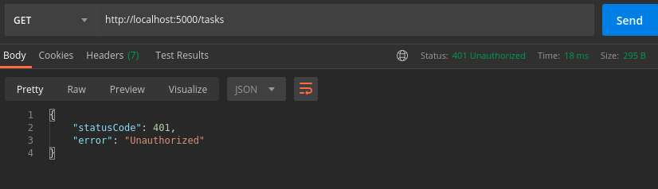
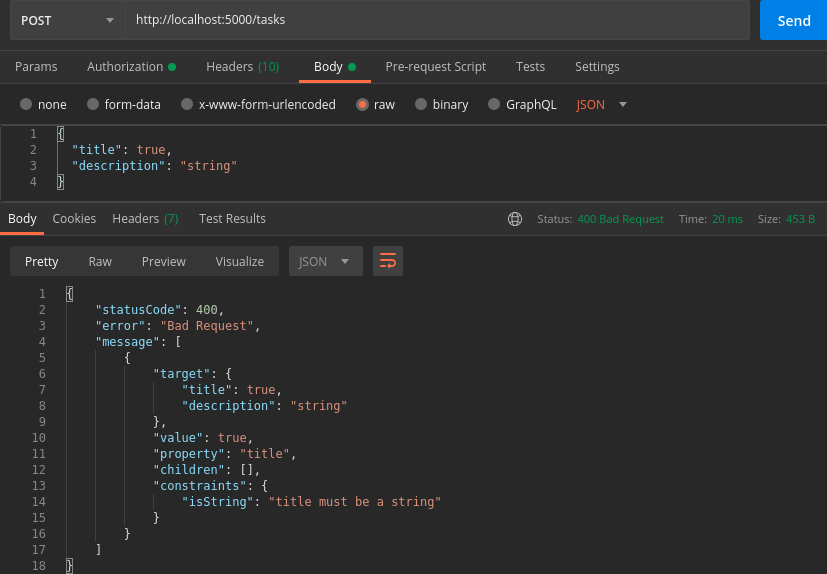
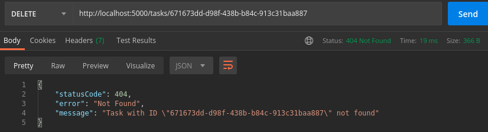
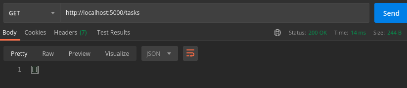
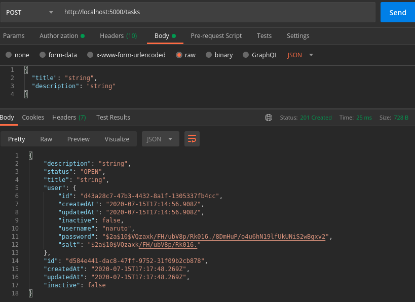
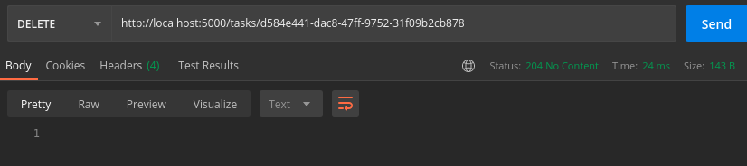

# API Design

**Every endpoint must be documented via Swagger. Ideally this will be done automatically, but depending on the project it might be necessary to do it manually. Documentation must be considered an integral part of API development.**

**Every endpoint must return a json format result, the only exception is enpoints that returns 204 (no content).**

**Validation. Every endpoint must be carefully validated, preferably mirroring the validation implemented on the front-end. Yes, validations should be duplicated and done both in front-end and back-end.**

**Don’t be lazy when writing your validation. It is a very important part of the system and ensures database integrity. Write specific validation for stuff like:**

* Phone/document number formats (use masks)
* ENUM inputs like ‘yes’ or ‘no’
* UUIDs

**Write and document your error handling carefully. Don’t just return error 500 any time something goes wrong, use the http status codes properly to inform your client of what exactly is going on. Even within the same status code, give proper error messages, for example: inform which fields are in the wrong format or missing in case of validation errors, inform whether it is the password or username/email that was wrong when getting an authentication error.**

**An example of error handling when the user is not authorized to access some content:**

**An example of error handling when the user tries to request an endpoint with wrong payload:**

**An example of error handling when the user input an entity that doesn't exist:**

**Some other good practices with http response status code:**

**GET, PUT or PATCH: 200 OK**

**POST: 201 Created**

**DELETE: 204 No Content**

