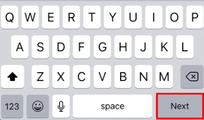
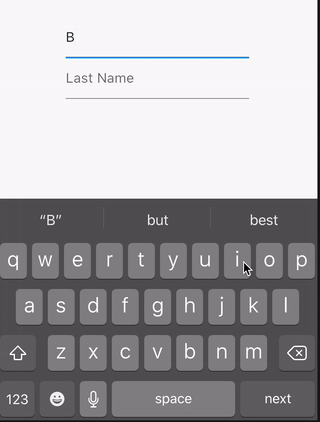
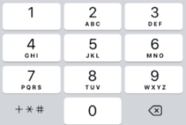

# Mobile Development and React Native

## Forms

Forms are one of the most annoying parts for users, so the more we can turn the experience of filling them out into something good, the less discomfort will be caused. Therefore, some react-native resources used for these purposes will be highlighted.


### Focus on the next input and submit directly from the keyboard

It is very annoying when we are filling out a form on the cell phone and we need to scroll down and select the next input. For this reason, mobile keyboards have a return key to assist in this case. The return key is usually found at the lower right corner of the keyboards and we can pass a function to be executed when it's pressed, such as to focus on the next text field or submit the form. Some platforms even allow you to replace it's label for best suit your use case.

The two attributes for React native's TextInput component that will help you with this are returnKeyType and onSubmitEditing.

**returnKeyType**

Defines a label for the return button, that is, it places the ideal name for the button in the lower corner, mentioned above.
The default values ​​can be:
- `done`
- `go`
- `next`
- `search`
- `send`

*How to use:*

    <TextInput
	    id="name"
	    value={name}
	    onChange={handleOnChange}
	    returnKeyType="next"
    />

*Result:*

Used in text fields to point to the next:




**onSubmitEditing**

Now that you know how to make the return buttons have coherent names, it is necessary to know how to add the functions that will make life easier for users. For this, onSubmitEditing is used, in which you can assign a function to focus on the next text field or submit the form. See the examples:

*How to use:*

    const inputRefLastName = useRef(null)
    
    <TextInput
      id="firstName"
      value={firstName}
      onChange={handleOnChange}
      returnKeyType="next"
      onSubmitEditing={() => inputRefLastName.current.focus()}
    />
    <TextInput
      id="lastName"
      ref={inputRefLastName}
    value={name}
      onChange={closeKeyboard}
      returnKeyType="done"
      onSubmitEditing={closeKeyboard}
    />

*Result:*



### Keyboard Types

The `keyboardType` attribute defines which type of keyboard to open when the user taps a text field. This way you make it easier for the user when the field is to fill the phone by adding the `phone-pad` type, for example.



The standard values that can be used are ([See the react-native documentation for others](https://reactnative.dev/docs/textinput#keyboardtype)):

-   `default`
-   `number-pad`
-   `decimal-pad`
-   `numeric`
-   `email-address`
-   `phone-pad`


### autoCapitalize

The `autoCapitalize` attribute is used to tell the keyboard to capitalize certain characters. In this way, we can make it easier for the user to type in their full name by adding the type `words` that leave the initial letter of each word in more capital.
The values that can be used are:

-   `characters`: all characters
-   `words`: first letter of each word
-   `sentences`: first letter of each sentence (default)
-   `none`: do not capitalize automatically

## Optimization

`Before run into the optimization rabbit role in your applications:`
> Measure. Don’t tune for speed until you’ve measured, and even then don’t unless one part of the code overwhelms the rest. - [Rob Pyke, 5 Rules of Programming](http://users.ece.utexas.edu/~adnan/pike.html)

### Images

Allways try to use the smallest possible image size. The larger the file, the longer they will take to transfer and display on the screen. Use image resizing software to compress the image. Remember to find a good balance between the quality and size of the photo.

`Note: some image pickers has the built-in option to apply some compress or resize to the image.`

#### Image size and suffixes

You can also use the suffix @2x and @3x, which will be displayed depending on the screen resolution of your device.

Example:
```
|src
|->assets
|  -> logo.png
|  -> logo@2x.png
|  -> logo@3x.png
|->App.js
```

```jsx
// App.js

import logo from '~/assets/logo.png';

export default function App() {

  return (
    <Image source={logo}>
  );
}
```

In the above example if your app are runnning your app on an `iPhone 7` the React Native will use the `logo@2x.png` file, while on an `iPhone 7 Plus` the `logo@3x.png` will be used. If the image size do note match the device screen, the best option will be selected.

#### Loading Static Assets

When loading asssets from the JavaScript bundle, React Native first imports the file and then sends it to Native UI (which is responsible for drawing the interface). If your assets are located in the native modules, React Native will simply tell the Native UI where the asset is located (`You can see the difference in the React Native architecture image below`).


So, depending on where your image is being used, and how often it is required by your application (like an icon), place it inside the native module would improve the UI loading.

To see how to use both aproches you can take a look at the [official documentation](https://reactnative.dev/docs/images#static-image-resources).

*@CONTRIBUTE Please teach me the ways of RN, master...*
